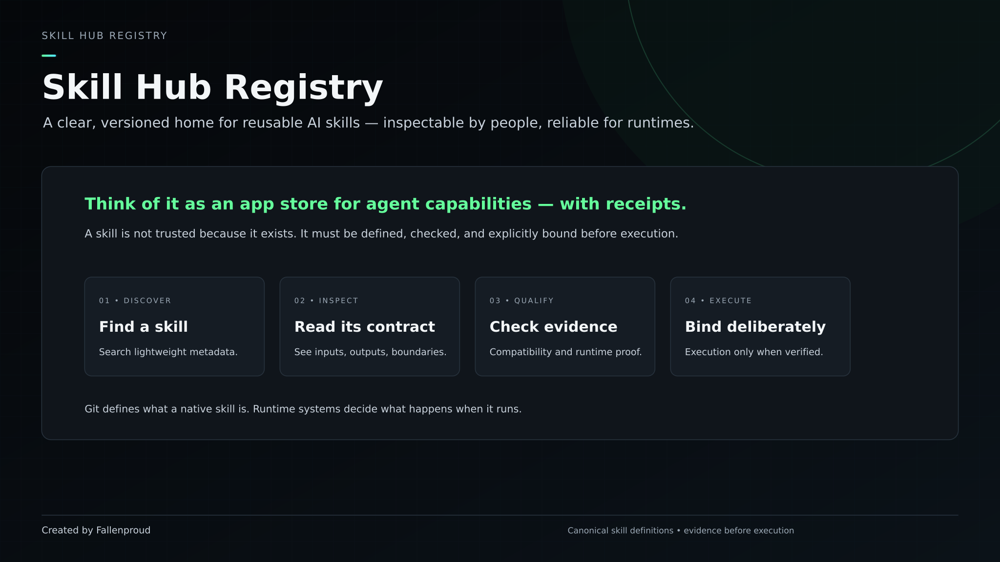
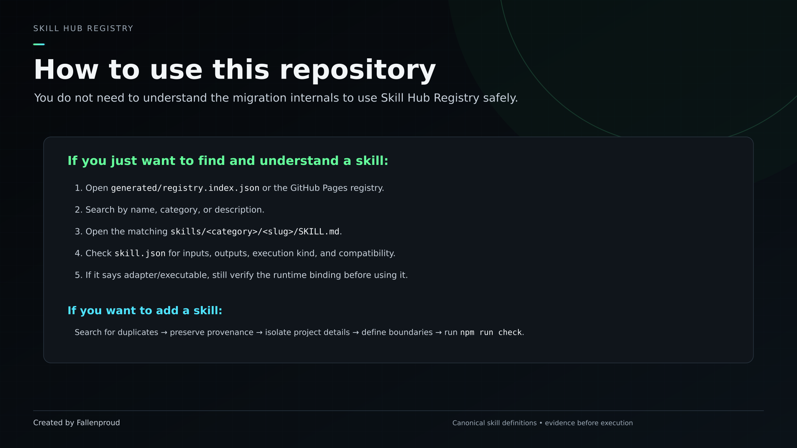
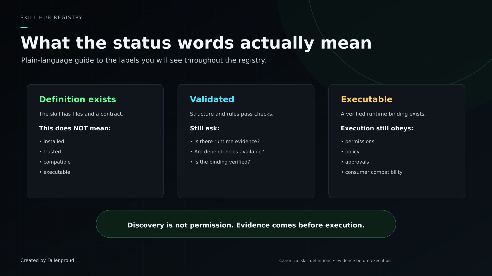
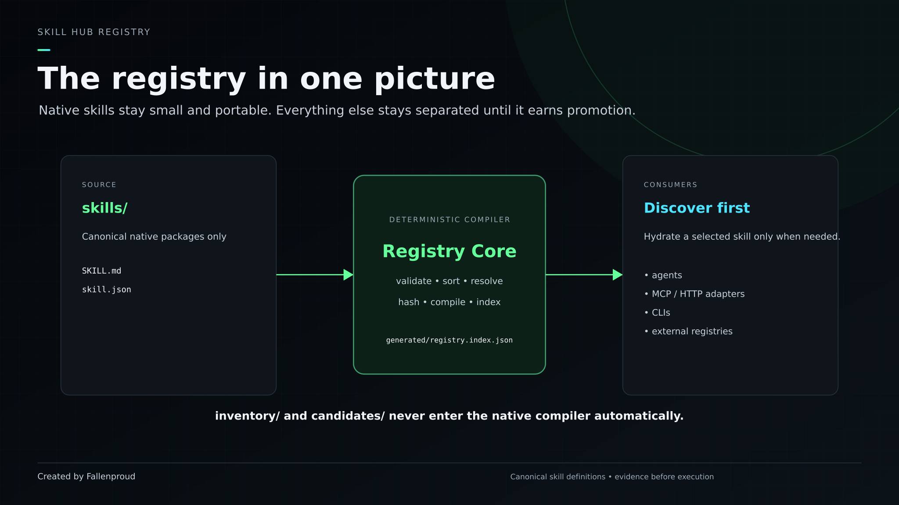
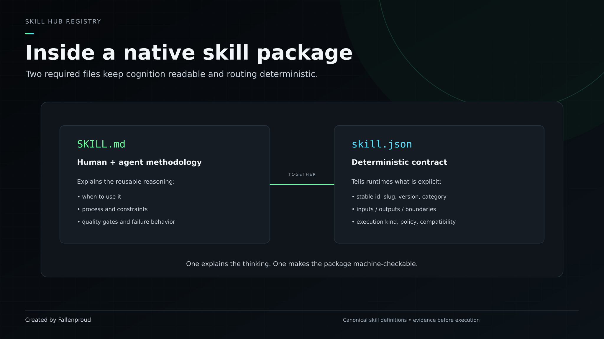
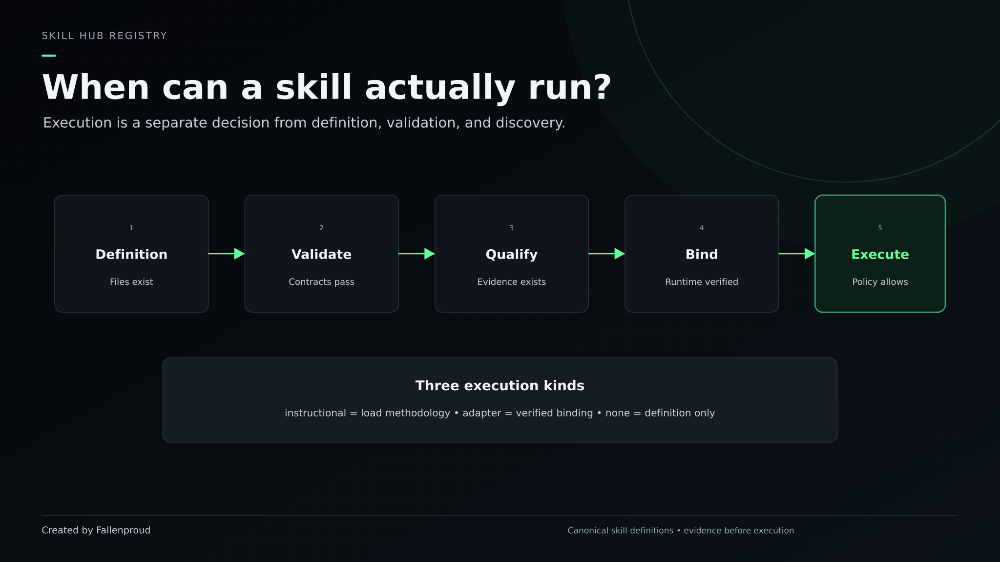
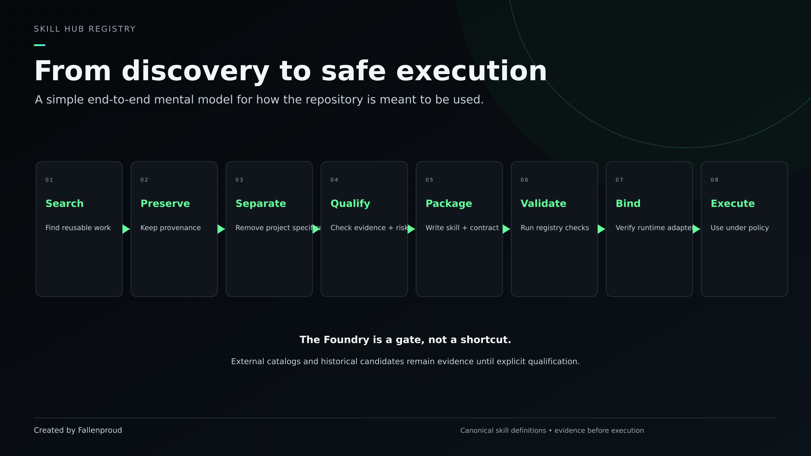

<p align="center">
  
</p>

# Skill Hub Registry

**Canonical skills. Portable cognition. Reliable execution.**

Skill Hub Registry is a Git-backed catalog of reusable AI/agent skills. It gives each skill a readable methodology, a machine-checkable contract, provenance, compatibility rules, and an explicit boundary between **definition** and **execution**.

If you are new to the project, the simplest mental model is:

> **Find a skill → read what it does → inspect its contract → verify whether it can actually run.**

A skill existing in this repository does **not** automatically mean it is installed, trusted, compatible, or executable.

GitHub Pages: **https://fallenproud.github.io/skill-hub-registry/**

---

## Start here

<p align="center">
  
</p>

### I just want to find a skill

1. Open the generated registry or the GitHub Pages site.
2. Search by **name**, **category**, or **description**.
3. Open the matching `skills/<category>/<slug>/SKILL.md` file to read the methodology.
4. Open `skill.json` beside it to inspect inputs, outputs, compatibility, policy, and execution metadata.
5. If the skill is marked executable or adapter-backed, verify the runtime binding before using it.

### I want to add a reusable skill

1. Search the existing registry, `inventory/`, and `candidates/` for duplicates.
2. Preserve the source/provenance first.
3. Remove project-specific identity unless the skill is intentionally domain-specific.
4. Write the skill methodology in `SKILL.md`.
5. Write the deterministic contract in `skill.json`.
6. Run `npm run check`.
7. Promote only when the evidence and runtime boundary are explicit.

See [`CONTRIBUTING.md`](CONTRIBUTING.md) for the contributor checklist.

---

## What the labels mean

<p align="center">
  
</p>

The most important rule in the repository is:

> **Discovery is not permission. Evidence comes before execution.**

A definition can exist without a runtime binding. A package can validate structurally without having production evidence. An external ecosystem record can be useful reference material without being a native Skill Hub skill.

---

## How the registry works

<p align="center">
  
</p>

The native compiler scans **`skills/` only**.

```text
skills/                         canonical native packages
inventory/                      historical, migration and external evidence
candidates/                     reusable ideas not yet ready for native discovery
sources/                        provenance/source records
foundry/                        qualification and promotion workflow
runtime-contracts/              invocation, migration and compatibility boundaries
profiles/                       project/domain-specific doctrine
generated/                      deterministic compiler output
```

`inventory/`, external catalogs, profiles, and migration evidence stay outside the native executable-registry scope unless they are explicitly qualified and promoted.

---

## What is inside a skill package?

<p align="center">
  
</p>

A native package is intentionally small:

```text
skills/<category>/<slug>/
├─ SKILL.md
└─ skill.json
```

### `SKILL.md`

The human/agent-readable cognition layer. It explains when to use the skill, when not to use it, the method, constraints, quality gates, and failure behavior.

### `skill.json`

The deterministic machine contract. It defines stable identity, routing, inputs/outputs, execution kind, policy flags, compatibility, dependencies, provenance, and runtime binding metadata.

See [`docs/SKILL_FORMAT.md`](docs/SKILL_FORMAT.md) for the complete native package contract.

---

## When can a skill actually execute?

<p align="center">
  
</p>

Execution is deliberately separate from definition.

| Execution kind | Meaning |
|---|---|
| `instructional` | Load the methodology into an agent/model. No dedicated adapter is implied. |
| `adapter` | An explicit, verified runtime binding exists. |
| `none` | Definition/specification exists, but it should not be treated as invokable cognition. |

Even adapter-backed skills remain subject to permissions, policy, approvals, compatibility, and runtime health.

---

## From discovery to native skill

<p align="center">
  
</p>

The Foundry is a **gate**, not a shortcut:

```text
discovery
→ provenance capture
→ normalization
→ reusable-capability extraction
→ duplicate / identity resolution
→ static qualification
→ sandbox qualification when required
→ compatibility + dependency review
→ security / license / policy review
→ treatment decision
→ validation
→ explicit native promotion only when justified
```

Allowed treatment decisions for candidate/external material:

`ADOPT | ADAPTER | REFERENCE | DEFER | REJECT`

---

## Current repository state

The following counts describe different populations. They should not be added together as if they were one executable catalog.

| Surface | Current state |
|---|---:|
| Native file-backed skill packages | **17** |
| Historical archaeology candidates | **35** |
| Post-July reusable capability candidates | **28** |
| Internal preserved candidate records | **63** |
| OpenClaw external ecosystem references | **65** |
| OpenClaw native promotions from import | **0** |
| v7 migration-confirmed legacy definitions | **65** |
| v7 authoritative live database rows | **65** |
| v7 explicit runtime adapters | **10** |
| Native compiler | **Deterministic + content-addressed** |
| Migration serving authority | **DB PRIMARY / FILE SHADOW** |

The 65 deployed v7 definitions are a **migration population**, not a blind extension of the 17-package native registry.

---

## Skill Hub v7 migration — advanced status

You can use the native registry without understanding this section. It exists for migration/reconciliation work.

Current reconciled truth:

```text
historical static product claim      88
migration-confirmed definitions      65
authoritative live DB rows           65
explicit runtime adapters            10
live/source identity drift            0
native ID collisions                  0
shadow definition mismatches          0
```

The previous `88 - 65 = 23` inference is closed: **88 was stale static product/UI metadata**, while the authoritative live population is 65.

### Serving authority

```text
Supabase DB  → PRIMARY / serves production definitions
Git v7 file  → SHADOW / comparison only
```

The first complete shadow comparison checked 65 skills across 20 definition fields with **0 mismatches**. Shadow results do not change routing, invocation, adapters, or returned definitions.

R1-A/B/C are complete. R1-D shadow mode is active. R1-E `db → hybrid` remains gated until repeated clean evidence closes the confidence window.

See:

- [`docs/R1_V7_CENSUS.md`](docs/R1_V7_CENSUS.md)
- [`inventory/v7/live-census.json`](inventory/v7/live-census.json)
- [`inventory/v7/shadow-evidence.json`](inventory/v7/shadow-evidence.json)

---

## External ecosystems

The OpenClaw catalog is preserved as a qualification/reference inventory, not as native Skill Hub execution authority.

```text
sources/openclaw/openclaw_ecosystem_schema.csv
        ↓
inventory/external/openclaw/index/part-01.json … part-13.json
        ↓
qualification / treatment decision
```

Current OpenClaw inventory:

- **65** external projects
- **14** P0 immediate-evaluation records
- **15** P1 high-value prototype records
- **19** P2 selective/reference records
- **17** P3 low-priority/current-mismatch records
- **65 / 65** retain `Tentative — user review required`
- **0** automatic native promotions

External discovery never authorizes automatic mirroring, installation, trust, or native promotion.

---

## Commands

Requires **Node.js 22+**.

For the normal validation path:

```bash
npm install
npm run validate
npm run build
npm test
```

For the full repository check:

```bash
npm run check
```

Specialized maintenance commands:

```bash
npm run import:openclaw
npm run census:v7
npm run reconcile:v7 -- path/to/live-v7-export.json
npm run site:build
```

`npm run reconcile:v7` is read-only.

---

## Repository guarantees

CI checks that:

- native manifests and `SKILL.md` packages validate;
- native IDs, slugs, dependencies, and compatibility remain coherent;
- preserved archaeology/migration evidence is not silently rewritten;
- OpenClaw normalized output remains deterministic and external;
- project-specific profiles remain outside native packages;
- the native registry remains deterministic/content-addressed;
- tests and the static onboarding build pass.

---

## Documentation map

| Document | Read this when... |
|---|---|
| [`docs/SKILL_FORMAT.md`](docs/SKILL_FORMAT.md) | you need to understand or create a native skill package |
| [`docs/ARCHITECTURE.md`](docs/ARCHITECTURE.md) | you need the five-plane architecture and source-of-truth rules |
| [`CONTRIBUTING.md`](CONTRIBUTING.md) | you want to add or modify reusable skills |
| [`docs/MIGRATION.md`](docs/MIGRATION.md) | you are working on legacy/v7 migration boundaries |
| [`docs/OPENCLAW_IMPORT.md`](docs/OPENCLAW_IMPORT.md) | you are qualifying external OpenClaw records |
| [`docs/ROADMAP.md`](docs/ROADMAP.md) | you want the staged registry roadmap |
| [`docs/SITE_IMPLEMENTATION_BLUEPRINT.md`](docs/SITE_IMPLEMENTATION_BLUEPRINT.md) | you are maintaining the GitHub Pages visual/onboarding experience |
| [`SKILL.md`](SKILL.md) | an agent is operating or auditing the repository itself |

---

## Roadmap

**R0 — Registry foundation** ✅  
Native registry, Foundry boundaries, deterministic compiler, archaeology, CI, Pages, and external inventory.

**R1 — v7 census + parity** 🚧  
R1-A/B/C complete. R1-D shadow mode active. R1-E remains gated by the confidence window.

**R1.1 — External ecosystem qualification**  
Current upstream/version/license/security verification for selected external candidates.

**R2 — Automated Skill Foundry**  
Archaeology automation, normalization, deduplication, qualification, creation, evidence, and promotion workflows.

**R3 — Signed/capability-gated execution**  
Signing, permission policy, approvals, audit events, retry/idempotency.

**R4 — Progressive agent discovery/load/invoke**  
Versioned, provenance-aware skill discovery for Sophie-X and compatible runtimes.

See [`docs/ROADMAP.md`](docs/ROADMAP.md).

---

## Contribution principle

**Preserve evidence first. Promote only when the reusable transformation, routing boundary, contracts, provenance, dependencies, security posture, compatibility, maturity, identity treatment, and execution state are explicit.**

Created and maintained by **[Fallenproud](https://github.com/Fallenproud)**.
