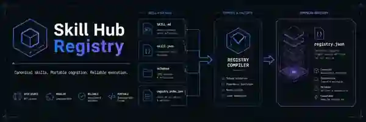

<p align="center">
  
</p>

# Skill Hub Registry

**Canonical skills. Portable cognition. Reliable execution.**

Skill Hub Registry is the Git-backed definition layer for reusable agent skills. It separates native skill cognition from runtime state and preserves archaeology/external ecosystems as evidence until they pass explicit Foundry and compatibility gates.

> **Core rule:** Git/files define **what a native skill is**. Runtime/control-plane services define **what happens when it runs**. Census or external inventory presence never implies installation, trust, compatibility, or execution.

## Current repository state

| Surface | Current state |
|---|---:|
| Native file-backed skill packages | **17** |
| Historical archaeology candidates | **35** |
| Post-July reusable capability candidates | **28** |
| Internal preserved candidate records | **63** |
| OpenClaw external ecosystem references | **65** |
| OpenClaw native promotions from import | **0** |
| v7 migration-confirmed legacy definitions | **65** |
| v7 authoritative live database rows | **65** |
| v7 explicit runtime adapters | **10** |
| Historical static v7 product claim | **88** |
| Current v7 product/live contract | **65** |
| Live-only / source-missing v7 rows | **0 / 0** |
| Native v7 ID collisions | **0** |
| First R1-D definition parity | **65 × 20, 0 mismatches** |
| Native compiler | **Deterministic + content-addressed** |
| Migration serving authority | **DB PRIMARY / FILE SHADOW** |
| Existing Skill Hub/Sophie API contract | **Preserved** |

GitHub Pages onboarding: `https://fallenproud.github.io/skill-hub-registry/`

The 65 deployed v7 definitions remain a **separate migration population**. They are not blindly promoted into the 17-package native registry.

## Architecture

```text
skills/                         canonical native packages only
  <category>/<slug>/
    SKILL.md
    skill.json

inventory/
  historical-candidates.json
  post-july-delta.json
  duplicate-decisions.json
  v7/                           deployed source/live/shadow evidence
  external/
    openclaw/                   reference / qualification inventory

sources/                        provenance records
foundry/                        archaeology → qualification → promotion
runtime-contracts/              invocation / migration / compatibility boundaries
profiles/                       project/domain-specific doctrine
src/ + scripts/ + tests/        deterministic compiler/census/import/validation
```

The native compiler scans `skills/` only. `inventory/`, sources, profiles, v7 census evidence, and external ecosystem records stay outside native executable-registry scope.

## Native skill format

```text
skills/<category>/<slug>/
├─ SKILL.md       # agent/human-readable methodology
└─ skill.json     # deterministic routing, contracts, policy and binding metadata
```

The compiler emits `generated/registry.index.json`. The index is content-addressed: identical native skill content produces identical registry output.

## R1 — Skill Hub v7 migration

The historical source census is pinned to `Fallenproud/skill-hub-builder`. Current reconciled truth:

```text
historical static product claim      88
migration-confirmed definitions      65
authoritative live DB rows           65
explicit runtime adapters            10
live/source identity drift            0
native ID collisions                  0
shadow definition mismatches          0
```

The old `88 - 65 = 23` live-database inference is closed. Supabase contains exactly 65 skill rows matching the 65 migration-confirmed identities; 88 was stale static UI/SEO/product metadata.

### Stable identity resolution

Deployed identities were preserved:

- `ux-001` → `UI-Design`
- `ux-002` → `UX-Research`

Provisional native packages were rekeyed:

- `Screenshot to Blueprint` → `ux-007`
- `Frontend Fidelity Reconstruction` → `ux-008`

`core-001 / LLM` remains the exact stable-ID/name native match.

### R1-D shadow mode

Skill Hub now runs the migration boundary as:

```text
Supabase DB  → PRIMARY / serves production definitions
Git v7 file  → SHADOW / comparison only
```

The first full comparison checked all 65 skills across 20 definition fields and returned **0 identity or field mismatches**. The same R1-D CI run passed production build and changed-surface lint.

Shadow results cannot affect routing, adapter selection, invocation, or returned definitions. Shadow fetch/audit failures fail open to DB. Existing HMAC, callbacks, IDs, `list-skills`, `invoke`, and Sophie-facing contracts are unchanged.

R1-A/B/C are complete. R1-D is active. **R1-E `db → hybrid` remains gated until repeated clean evidence closes the confidence window.**

See:

- [`docs/R1_V7_CENSUS.md`](docs/R1_V7_CENSUS.md)
- [`inventory/v7/live-census.json`](inventory/v7/live-census.json)
- [`inventory/v7/shadow-evidence.json`](inventory/v7/shadow-evidence.json)

## OpenClaw inventory import

The OpenClaw ecosystem catalog is preserved and normalized without changing canonical architecture.

```text
sources/openclaw/openclaw_ecosystem_schema.csv
        ↓ validated external projection
inventory/external/openclaw/index/part-01.json … part-13.json
inventory/external/openclaw/schema.json
inventory/external/openclaw/summary.json
```

Imported state:

- **65** external projects
- **14** P0 immediate-evaluation records
- **15** P1 high-value prototype records
- **19** P2 selective/reference records
- **17** P3 low-priority/current-mismatch records
- **65 / 65** retain `Tentative — user review required`
- **0** automatic native promotions

External discovery does not authorize automatic mirroring or native promotion.

### Qualification boundary

```text
discovery
→ static qualification
→ sandbox qualification
→ compatibility testing
→ evidence capture
→ governed treatment decision
```

Allowed treatment results:

`ADOPT | ADAPTER | REFERENCE | DEFER | REJECT`

## Leave No Reusable Skill Behind

Discovery is not promotion.

```text
Search historical/external/deployed work
        ↓
Capture provenance
        ↓
Extract transformation/capability
        ↓
Isolate project/domain/external specifics
        ↓
Classify evidence + maturity
        ↓
Deduplicate by identity + contract
        ↓
Qualify security/dependencies/runtime
        ↓
Draft skill/profile/adapter decision
        ↓
Validate + test
        ↓
Promote only when justified
```

## Project separation

Project-specific identity and doctrine remain under `profiles/` or future `specimens/`. External ecosystem suggestions may mention target products, but those suggestions never authorize cross-project coupling.

## Skill Hub v7 migration sequence

```text
1. Pin and census v7 source                     ✅
2. Export current live Skill Hub database       ✅
3. Reconcile source ↔ live identities           ✅ 65/65 exact
4. Resolve native stable-ID collisions          ✅ ux-007 / ux-008 rekeys
5. Capture full live definition snapshot        ✅ 65 × 20 fields
6. Run DB/file shadow comparisons               🟢 active; first pass exact
7. Accumulate confidence-window evidence        ⏳
8. db → hybrid only after explicit gate         ⛔
9. hybrid → files only after evidence closes    ⛔
```

## Commands

Requires **Node.js 22+**.

```bash
npm run import:openclaw
npm run validate
npm run build
npm run census:v7
npm run reconcile:v7 -- path/to/live-v7-export.json
npm test
npm run site:build
npm run check
```

`npm run census:v7` validates historical source evidence, the authoritative live export, and native parity. `npm run reconcile:v7` is read-only.

## CI invariants

CI verifies that:

- native manifests and `SKILL.md` packages validate;
- native IDs/slugs and dependencies are coherent;
- historical/delta inventories retain expected counts;
- historical v7 evidence remains preserved rather than rewritten;
- the authoritative v7 live export remains 65 rows;
- native deployed-ID collisions remain resolved;
- the 10 v7 runtime bindings remain separate from definition count;
- v7 census performs zero automatic native promotions;
- OpenClaw normalized output is deterministic and external;
- project-specific profiles remain outside native packages;
- the native registry remains deterministic/content-addressed;
- tests and static onboarding build pass.

## Roadmap

**R0 — Registry foundation** ✅  
Native registry, Foundry boundaries, deterministic compiler, archaeology, CI, Pages, and external OpenClaw inventory.

**R1 — v7 census + parity** 🚧  
R1-A/B/C complete. R1-D shadow mode active with first full-definition pass exact. R1-E remains gated by the confidence window.

**R1.1 — External ecosystem qualification**  
Current upstream/version/license/security verification for selected OpenClaw candidates; explicit treatment decisions only after evidence.

**R2 — Automated Skill Foundry**  
Archaeology automation, normalization, deduplication, qualification, creation, evidence and promotion workflows.

**R3 — Signed/capability-gated execution**  
Signing, permission policy, approvals, audit events, retry/idempotency.

**R4 — Progressive agent discovery/load/invoke**  
Versioned, provenance-aware skill discovery for Sophie-X and compatible runtimes.

See [`docs/ROADMAP.md`](docs/ROADMAP.md).

## Contribution principle

Preserve evidence first. Promote only when the reusable transformation, routing boundary, contracts, provenance, dependencies, security posture, compatibility, maturity, identity treatment, and execution state are explicit.
